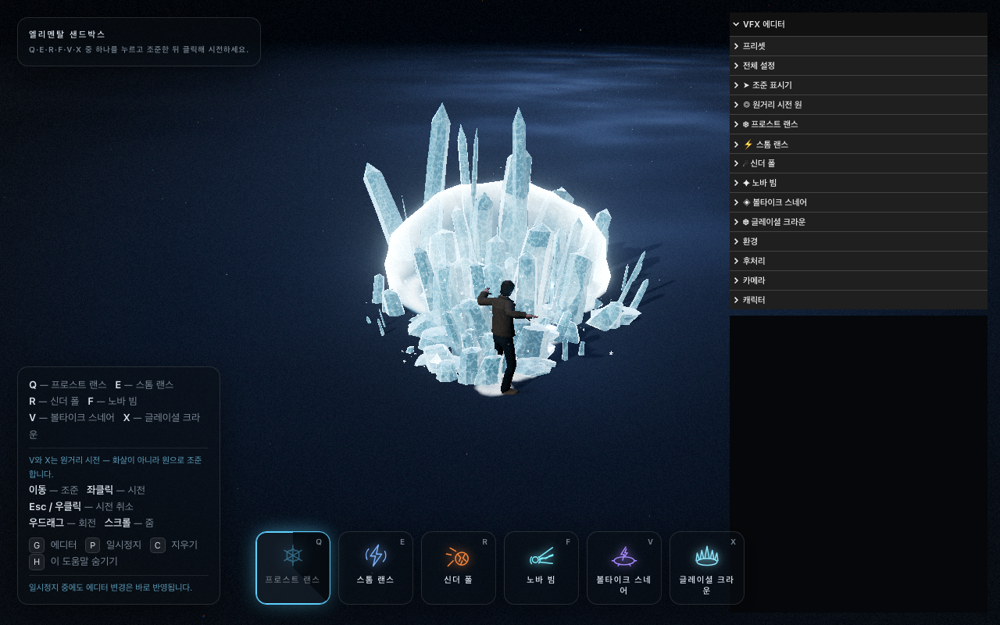

# 엘리멘탈 샌드박스

<p align=center></p>

라이브 데모 : https://sigco3111.github.io/LinearAbiltyCastingThreeJS/

[](https://sigco3111.github.io/LinearAbiltyCastingThreeJS/)

**Three.js** · **Vite** · 직접 작성한 **GLSL**로 만든 스킬샷 VFX 샌드박스입니다.

여섯 개의 능력, 두 가지 조준 방식. 네 개는 **라인 시전**입니다. 키를 눌러 무장하면
리그 오브 레전드 스타일의 화살이 바닥에 나타나 마우스를 따라 움직이고, 클릭하면 발사됩니다.
두 개는 **원거리 시전**입니다. 화살 대신 의도적으로 두꺼운 경계선을 가진 원이 커서를
따라다니며, 지점 스킬이 클릭 전에 답해야 하는 단 하나의 질문 — "이게 도대체 얼마나
넓은 범위야?" — 에 답합니다.

| 키 | 능력 | 설명 |
| --- | --- | --- |
| **Q** | 프로스트 랜스 | 균열 전선이 라인을 따라 질주하고, 그 뒤로 얼음 결정 밭이 바닥에서 솟아오릅니다. 발밑에서는 작고 촘촘하게, 끝으로 갈수록 칼날 벽으로 벌어지며, 충돌 지점 주변에도 결정 무더기가 솟구칩니다. |
| **E** | 스톰 랜스 | 시전자의 손에서 번개가 나가고, 타격 전선 뒤로 번개 필라멘트 다발이 끌려나와 잠시 유지되다가 꺼지며 재타격합니다. 가는 길 내내 불꽃이 튀고, 밑바닥에는 나뭇가지 모양의 전기 화상과 검은 그을음이 남으며, 끝에는 이온화된 공기 껍질이 맺힙니다. |
| **R** | 신더 폴 | 불타는 암석을 포물선으로 멀리 던지면, 레에마치된 연소 가스 후류를 끌며 오는 내내 달아오릅니다. 표면을 가르는 용암 틈새가 다가올수록 넓게, 밝게 벌어지다가 도착과 동시에 폭발해 깨진 조각을 바닥에 흩뿌리고, 땅을 녹은 균열 네트워크로 찢어 분화구가 식을 때까지 계속 빛납니다. |
| **F** | 노바 빔 | 시전자가 양손으로 빛의 구를 감아 올리며 공기 중 미립자를 빨아들인 뒤, 라인을 따라 기둥을 뿜습니다. 백열 중심, 청록 외피, 휘감는 황금 리본, 기둥을 타고 내려가는 충격 디스크. 그 자리에 *버티며* 바닥을 태우고 뒤로 스프레이를 쏘아 올리다가, 실처럼 가늘어지며 깜빡 꺼집니다. 착탄 1초 뒤에도 아직 진행 중인 샌드박스 유일의 시전입니다. |
| **V** | 볼타이크 스네어 | 원거리 시전. 전류 끈을 바닥에 휙 내던지면, 떨어진 지점에서 고리가 자기 반지름을 넘겨 벌어졌다가 다시 조여듭니다. 가운데에서 보라색 기둥이 치솟고, 덩굴손이 경계까지 기어가고, 가장자리를 아크가 돌며 원반 전체가 탑니다. 재타격하며 공기를 기둥으로 빨아 올리다가 실처럼 붕괴합니다. 클릭 전에 재어 둔 원 그대로 떨어집니다. |
| **X** | 글레이셜 크라운 | 두 번째 원거리 시전. 범위 안에 얼음 왕관이 피어오릅니다. 다섯 개의 칼날이 고리를 따라 높낮이를 달리 세워지고, 가운데 첨탑이 가장 높이 솟는 실루엣 — 슬롯 아이콘 그대로의 장면이 바닥에 재현됩니다. |

## 전부 절차적으로 생성됩니다

보이는 모든 것은 생성된 것입니다. 캐릭터를 제외하고 디스크에 텍스처도,
스프라이트 시트도, 메시도 없습니다. 결정은 절차적 지오메트리, 번개는
버텍스 셰이더가 배치한 리본 스트립, 운석은 CPU에서 균열면으로 쪼개고
분화구를 낸 icosphere, 빔은 세 가지 반지름으로 세 번 그린 파라메트릭 튜브,
스네어의 우리 전체는 네 가지 파라메트릭 경로를 따라 꿰맨 바로 그 리본 스트립,
화살·조준 원·서리·화상·녹은 균열은 부호거리·노이즈 셰이더, 안개·불꽃·파편·반짝이는
GPU 파티클입니다.

**모든 파라미터가 실시간 슬라이더** — 938개 — 이며, 시뮬레이션이 멈춰 있어도
계속 살아 있습니다. 이 프로젝트의 요점이 바로 그것입니다. 분출 한가운데,
타격 한가운데, 연소 한가운데를 **P**로 얼린 뒤, 정지 화면을 보며 실루엣과
팔레트와 타이밍을 다듬으세요.

---

## 빠른 시작

```bash
npm install
```

```bash
npm run dev
```

Vite가 출력한 URL을 여세요 (기본 <http://127.0.0.1:5173>).

```bash
npm run build
```

```bash
npm run preview
```

### 에셋

여섯 개의 바이너리 에셋이 `public/`에서 제공되며 부팅 시 자동으로 로드됩니다.

| 파일 | 용도 |
| --- | --- |
| `public/models/Idle.fbx` | 리그된 캐릭터 **및** 대기 애니메이션 클립 |
| `public/models/diffuse.png` | 캐릭터 컬러 맵 |
| `public/models/cast1.fbx` | 캐스트 애니메이션 |
| `public/models/cast2.fbx` | 캐스트 애니메이션 |
| `public/models/cast3.fbx` | 캐스트 애니메이션 — 프로스트 랜스·볼타이크 스네어·글레이셜 크라운의 기본값 |
| `public/hdri/spruit_sunrise.hdr` | 이미지 기반 조명과 결정 반사광에 쓰는 HDR 프로브 |

네 FBX 파일은 모두 같은 리그의 Mixamo 익스포트로, 스킨드 메시 + 애니메이션
스택 하나씩을 담고 있습니다. 캐릭터는 idle 파일에서 오고, cast 파일들은
클립만을 위해 로드되며, 딸려 온 복제 리그는 `AnimationClip`을 떼어내는 즉시
해제됩니다. 클립이 뼈대 이름으로 바인딩되기에, 다른 파일에서 만든 애니메이션이
리타게팅 없이 그대로 재생됩니다.

리그에 머티리얼이 없으므로 `diffuse.png`를 옆에 로드해 임포트된 머티리얼을
PBR로 변환할 때 컬러 맵으로 붙입니다. 내장 텍스처를 가진 FBX는 자기 UV에
맞춰 만든 맵이므로 그쪽을 유지합니다.

각 능력은 자기가 던질 클립을 직접 고릅니다 — 설정 블록의 `castAnim`,
에디터 폴더의 **시전** 아래 드롭다운. 기본값으로 1·5·6번 슬롯(프로스트 랜스,
볼타이크 스네어, 글레이셜 크라운)은 `cast3`, 나머지 셋은 `cast1`을 던집니다.
클립은 반복되는 idle 위에 얹는 원샷이며, 그 겹침의 양쪽 경계가
`character.castBlendIn` / `character.castBlendOut` 입니다.

HDR은 이미지 기반 조명과 얼음 반사광으로만 쓰이고, 보이는 하늘로는 절대
나오지 않습니다. 무대는 평평하고 어두운 배경을 유지합니다.

---

## 조작법

| 입력 | 동작 |
| --- | --- |
| **Q** (또는 **1**) | 프로스트 랜스 무장 — 다시 누르면 해제 |
| **E** (또는 **2**) | 스톰 랜스 무장 — 다시 누르면 해제 |
| **R** (또는 **3**) | 신더 폴 무장 — 다시 누르면 해제 |
| **F** (또는 **4**) | 노바 빔 무장 — 다시 누르면 해제 |
| **V** (또는 **5**) | 볼타이크 스네어 무장 — 원으로 조준하는 원거리 시전 |
| **X** (또는 **6**) | 글레이셜 크라운 무장 — 원으로 조준하는 원거리 시전 |
| **마우스 이동** | 조준 화살을 휘두르거나 원거리 원을 이동 |
| **좌클릭** | 화살 방향으로 시전, 또는 원을 그 자리에 떨굼 |
| **Esc** / **우클릭** | 무장한 시전 취소 |
| **우클릭 + 드래그** | 카메라 회전 |
| **스크롤** | 줌 |
| **G** | VFX 에디터 표시/숨기기 |
| **P** | 일시정지 / 재개 — *에디터는 계속 반영됩니다* |
| **C** | 활성 이펙트 전부 지우기 |
| **H** | 조작 패널 숨기기 |

`range`와 `minRange`는 능력별 값이라, 선택한 슬롯이 바뀌면 표시기의
사거리도 바뀝니다. 선택한 능력의 `minRange`보다 가깝게 조준하면 표시기가
빨갛게 물들고 시전을 거부합니다. 자기 발밑에 떨구고 싶으면 `minRange`를
0으로 두세요. 스네어가 그렇게 출고됩니다 — 자기에게 못 떨구는 덫은
쓸모가 반쪽입니다. 재사용 대기시간도 능력별이라, 한 슬롯을 썼다고 다른
슬롯이 잠기지 않습니다.

---

## 프로젝트 구조

```
src/
  abilities/      능력 베이스 클래스(움직이는 전선), IceAbility, ThunderAbility,
                  MeteorAbility, BeamAbility, SnareAbility, 풀링 매니저
  animation/      FBX 캐릭터 로딩, AnimationMixer, 능력별 캐스트 클립,
                  절차적 캐스트 돌진
  assets/         절차적 결정·소행성 지오메트리, 번개 리본 스트립,
                  빔 튜브와 충격 디스크
  config/         settings.js — 모든 파라미터의 단일 진실 공급원
  core/           App, Renderer, CameraRig, Time, Layers, 공유 프레임 유니폼
  effects/        조준 화살, 원거리 원, 바닥 데칼, 균열, 폭발,
                  라이트 풀, 흔들림, 섬광
  input/          InputManager(이벤트)와 AimController(두 가지 조준 형태)
  loaders/        공유 LoadingManager를 쓰는 AssetLoader
  materials/      IceMaterial, LightningMaterial, MeteorMaterial,
                  VolumetricFireMaterial, BeamMaterial, SnareMaterial
  particles/      GPU 파티클 시스템 + 엔진과 방출기
  postprocessing/ Composer 파이프라인, 그레이드 셰이더, 왜곡 셰이더
  shaders/lib/    공유 GLSL: 노이즈 라이브러리, 공용 헬퍼
  ui/             HUD, lil-gui 에디터, 프리셋 매니저, 스타일
  utils/          수학, 색상 캐시, 풀링, 해제, 셰이더 패치
  world/          Environment(무대 조명), 바닥, 먼지, 접촉 그림자
  archive/        은퇴한 4원소 샌드박스 — archive/README.md 참조
```

---

## 동작 원리

### 설정이 곧 API입니다

`src/config/settings.js`가 조정 가능한 모든 값을 담고 있습니다. 다른 무엇도
그 상태를 소유하지 않습니다. 셰이더·파티클 시스템·조명·포스트 패스는 매 프레임
그 객체들을 *읽기만* 합니다. 그래서 에디터가 리빌드 없이 동작합니다. 슬라이더를
움직이면 이미 서 있는 얼음 밭도, 다음 시전도, 환경도, 포스트 스택도 한 번에
바뀝니다. 프리셋 로딩은 같은 객체들에 *깊게 병합*되므로 살아 있는 바인딩이
하나도 깨지지 않습니다.

```js
import { settings } from './config/settings.js';
settings.ice.height = 7;          // 다음 프레임에 보임, 시전 한가운데라도
settings.thunder.jitter = 1.2;    // 이미 날아가는 번개를 다시 꺾음
settings.global.timeScale = 0.1;  // 시전 전체를 느리게 기어가게
```

능력 블록은 `ELEMENTS`의 id로 키잉되며, "플레이어가 지금 들고 있는 능력이
뭔지" 알아야 하는 공유 시스템 — 조준 컨트롤러, 재사용 대기시간, HUD — 은
`settings[element]`로 조회합니다. 반드시 있어야 하는 네 필드는 `range`,
`minRange`, `speed`, `cooldown`이며, 원거리 시전은 다섯 번째 `zoneRadius`를
더합니다. 블록의 나머지는 그 능력의 사정입니다.

### "일시정지 중 편집"이 성립하는 규칙

`IceAbility`의 스파이크 레코드는 **주사위가 정한 것만** 저장합니다. 라인을
따른 위치 *비율*, 부호 있는 좌우 *비율*, 단위 없는 지터 몇 개. 시전이 시작될 때
단 하나의 미터·라디안·초도 확정하지 않습니다. 모든 치수는 업데이트 루프 안에서
`settings.ice`를 기준으로 해소되며, 그 루프는 길이가 0인 프레임에도 돕니다.

그래서 `height`를 드래그하면 이미 서 있는 밭이 다시 자라고, `lean`을 드래그하면
다시 기울고, `clumping`을 드래그하면 중심선 쪽으로 다시 모입니다. 레코드가
*확정하는* 유일한 값은 타임스탬프 — 자기 분출이 촉발된 순간. 그건 사건이지
치수가 아닙니다.

네 가지 *형태* 컨트롤(`facets`, `taper`, `roughness`, `bend`)은 인스턴스별
변환으로 표현할 수 없어 지오메트리에 직접 구워집니다. 육각 결정 하나가 고작
60개 삼각형이라, 버텍스 셰이더로 근사하느니 통째로 다시 만드는 편이 쌉니다.

---

## VFX 에디터와 프리셋

**G**를 누르면 실시간 VFX 에디터가 열립니다. 모든 컨트롤은 `config/settings.js`
필드에 직접 바인딩됩니다. `onChange` 핸들러가 필요 없습니다. 슬라이더를
움직이면 이미 서 있는 얼음 밭도, 날아가는 번개도, 다음 시전도, 환경도,
포스트 스택도 동시에 바뀌고, 리빌드도 셰이더 재컴파일도 없습니다.

시뮬레이션을 일시정지(**P**)한 상태에서도 성립합니다. 그게 요점입니다. 얼어붙은
분출의 실루엣과 얼어붙은 번개의 형태야말로 다듬을 가치가 있는 것이고, 두 능력은
길이가 0인 프레임에 이 값들로부터 자신을 다시 해소합니다.

| 폴더 | 내용 |
| --- | --- |
| 프리셋 | 저장·불러오기·복제·삭제, JSON 내보내기/가져오기, 기본값 초기화 |
| 전체 설정 | 시간 배율·시전 속도·발광·노이즈·파티클·조명·흔들림 전역 배율 |
| ➤ 조준 표시기 | 화살 외형(미터)·렌더링·에너지 줄무늬·서리 결정·바닥 고리 |
| ◎ 원거리 시전 원 | 경계선 두께·내부·눈금·소인·조준선·사거리 고리 |
| ❄ 프로스트 랜스 외 5종 | 시전·실루엣·재질·바닥·파티클·충돌·조명 능력별 전절 |
| 환경 | 주광·림 라이트·배경·안개·먼지·무대 바닥 |
| 후처리 | 노출·블룸·대비·채도·온도·비네팅·색수차·필름 그레인 |
| 카메라 | 거리·시야각·피치·추적 감쇠·자동 프레이밍 |
| 캐릭터 | 재생 속도·캐스트 블렌드·조준 회전·돌진 |

프리셋은 설정 트리의 스냅샷 그대로이며 localStorage에 저장되고 JSON으로
내보낼 수 있습니다. 로딩은 살아 있는 설정 객체에 병합되므로, 셰이더와
파티클 시스템이 쥔 바인딩이 전부 유효하게 남습니다 — 그래서 시전 한가운데에
프리셋을 갈아타도 됩니다.

---

## 성능 노트

- 파티클은 GPU 풀에서 돕니다. HUD 우상단의 파티클·인스턴스·드로콜 수치로
  병목을 바로 확인할 수 있습니다.
- 여섯 FBX 중 cast 파일 셋은 클립만 취하고 복제 리그는 즉시 해제됩니다.
- 셰이더는 부팅 시 전부 미리 컴파일하므로 첫 시전이 버벅이지 않습니다.
- 일시정지해도 에디터 변경은 다음 프레임에 반영됩니다. 멈춘 장면을 보며
  다듬는 용도입니다.

## 아카이브

`src/archive/`는 은퇴한 4원소(불·대지·물·바람) 샌드박스입니다. 현재 여섯 능력과
겹치지 않는 머티리얼·이펙트만 보관용으로 남았고, 빌드에는 포함되지 않습니다.
자세한 내역은 `src/archive/README.md`를 보세요.

## 알려진 한계

- FBX 스키닝 가중치가 정점당 4개를 넘으면 로더가 나머지를 버리고 경고합니다.
  (Mixamo 리그 특성 — 보이는 결과에는 영향이 없습니다.)
- `PCFSoftShadowMap`은 Three.js 최신 버전에서 deprecated라 자동으로
  `PCFShadowMap`으로 대체됩니다.
- 소프트웨어 렌더러(헤드리스 캡처 등)에서는 `ReadPixels` GPU stall 경고가
  나올 수 있습니다. 실제 GPU에서는 발생하지 않습니다.

## 라이선스

MIT — 원본 저장소의 LICENSE를 따릅니다.

## 원본 출처

원본: [achrefelouafi/LinearAbiltyCastingThreeJS](https://github.com/achrefelouafi/LinearAbiltyCastingThreeJS) (MIT).
이 저장소는 해당 프로젝트의 한글화 버전입니다. 능력 이름·HUD·VFX 에디터
라벨 1,300여 개를 한국어로 옮겼으며, 게임 로직·식별자·에셋은 원본 그대로입니다.
